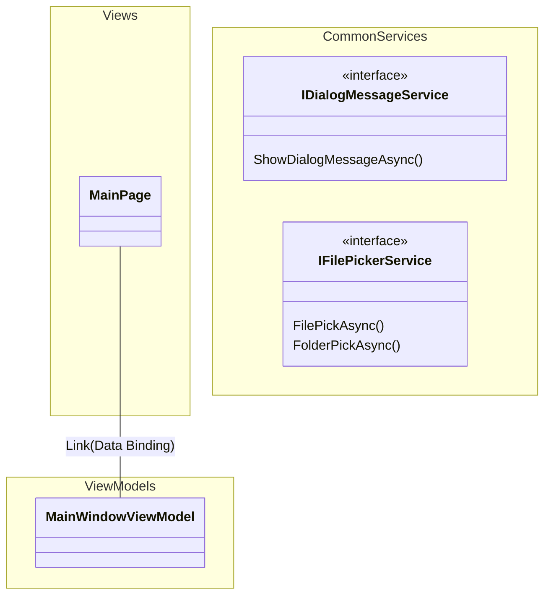

# SimpleDicomViewer
DICOMビュワーアプリです。  
``WinUI 3``, ``.NET6`` を採用しています。

# DEMO
※ 2024/03/27 時点のものです  
https://github.com/Puye123/SimpleDicomViewer/assets/32557553/880c5583-9f72-44b4-b9c5-d3c578c84cf8

## Old
※ 2024/03/26 時点のものです  
https://github.com/Puye123/SimpleDicomViewer/assets/32557553/c9b825a8-e392-4350-8149-3b1f61ba8cf1

※ 2024/03/11 時点のものです  
https://github.com/Puye123/SimpleDicomViewer/assets/32557553/4783a140-d4ed-43a0-af45-a7bb2c847f6f

# Feature
* DICOMファイル(.dcm etc)の読み込み
* 読み込んだDICOMデータの一覧表示
* 選択したDICOMデータのタグ一覧表示
* 画像データの表示（非圧縮）
## Not Implemented
* フォルダ単位でのDICOMデータ読み込み
* 画像データの表示 (ランレングス圧縮)
* 画像データの表示 (JPEG圧縮)
* 画像の保存機能 (BMP)
* 画像の保存機能 (JPEG)
* DICOM辞書の実装およびタグ名の表示
* アプリアイコン
* DICOMデータのファイル出力 (txt)
* DICOMデータのファイル出力 (json)
* ``.NET8`` 対応
* 日本語対応
* 画像処理機能

# Class Diagram

一部抜粋版です

# License
``SimpleDicomViewwer`` is under [MIT license](https://en.wikipedia.org/wiki/MIT_License).
