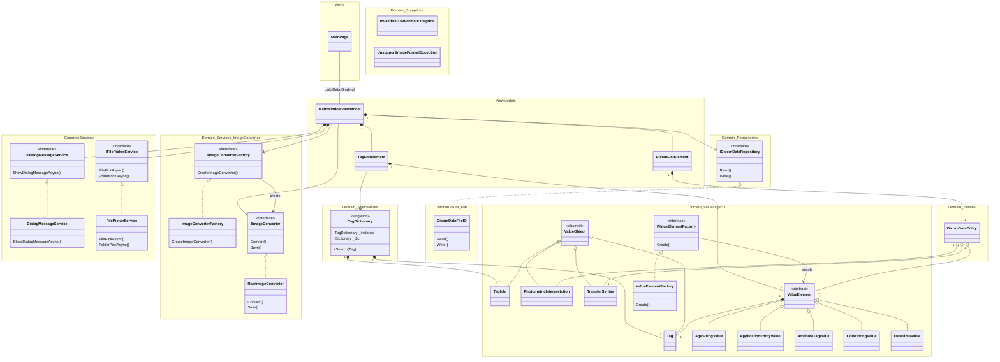

# SimpleDicomViewer
DICOMビュワーアプリです。  
``WinUI 3``, ``.NET6`` を採用しています。

> [!WARNING]
> このDICOMビュワーは医療用ではありません。

# DEMO
※ 2024/04/02 時点のものです

https://github.com/Puye123/SimpleDicomViewer/assets/32557553/00680410-c33b-410c-9cd0-0d8265e9bf39

## Old
※ 2024/04/01 時点のものです  
https://github.com/Puye123/SimpleDicomViewer/assets/32557553/63c67cbc-26bc-4619-8daf-429bbdeaf25b

※ 2024/03/29 時点のものです  
https://github.com/Puye123/SimpleDicomViewer/assets/32557553/25e1abb5-d06d-4aba-8b93-78a48185a1cd

※ 2024/03/27 時点のものです  
https://github.com/Puye123/SimpleDicomViewer/assets/32557553/880c5583-9f72-44b4-b9c5-d3c578c84cf8

※ 2024/03/26 時点のものです  
https://github.com/Puye123/SimpleDicomViewer/assets/32557553/c9b825a8-e392-4350-8149-3b1f61ba8cf1

※ 2024/03/11 時点のものです  
https://github.com/Puye123/SimpleDicomViewer/assets/32557553/4783a140-d4ed-43a0-af45-a7bb2c847f6f

# Feature
* DICOMファイル(.dcm etc)の読み込み
* 読み込んだDICOMデータの一覧表示
* 選択したDICOMデータのタグ一覧表示
* 画像データの表示（非圧縮）
* DICOM辞書の実装およびタグ名の表示
* フォルダ単位でのDICOMデータ読み込み

## Not Implemented
* ``Window Center``(0028, 1050) と ``Window Width``(0028, 1051) を用いた画面表示用コントラスト調整
* 画像データの表示 (ランレングス圧縮)
* 画像データの表示 (JPEG圧縮)
* 画像の保存機能 (BMP)
* 画像の保存機能 (JPEG)
* アプリアイコン
* DICOMデータのファイル出力 (txt)
* DICOMデータのファイル出力 (json)
* ``.NET8`` 対応
* 日本語対応
* 画像処理機能

# Class Diagram

一部抜粋版です

> [!NOTE]
> 現状はViewModelが直接Domain層にアクセスしているが、ViewModelが肥大化した場合はApplication層を新たに設けてFacade的な処理をViewModelから移譲させる。

# License
``SimpleDicomViewwer`` is under [MIT license](https://en.wikipedia.org/wiki/MIT_License).
